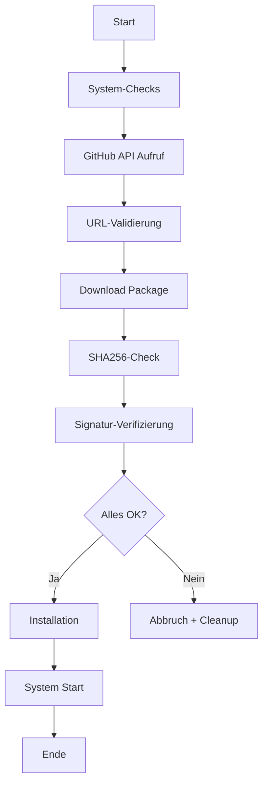

# Apple Container Update Script

Sicheres Update-Script für [Apple Container](https://github.com/apple/container) mit erweiterten Sicherheitsprüfungen und automatisiertem Installations-Prozess.

## 🔒 Sicherheits-Features

- ✅ **SHA256-Checksummen-Validierung** - Verifiziert Download-Integrität
- ✅ **Paket-Signatur-Verifizierung** - Prüft Apple Developer ID Signatur
- ✅ **Sichere temporäre Dateien** - Verwendet `mktemp` für unvorhersehbare Pfade
- ✅ **Download-URL-Validierung** - Akzeptiert nur github.com URLs
- ✅ **Festplattenspeicher-Check** - Prüft verfügbaren Speicher vor Download
- ✅ **Automatisches Cleanup** - Entfernt temporäre Dateien bei Fehlern
- ✅ **Versions-Vergleich** - Erkennt bereits installierte Versionen
- ✅ **macOS Version-Validierung** - Mindestens macOS 15 erforderlich

## 📋 Systemanforderungen

- **Hardware**: Mac mit Apple Silicon (arm64)
- **Betriebssystem**: macOS 15+ (Sequoia oder neuer)
- **Empfohlen**: macOS 26+ für vollständige Features
- **Netzwerk**: Internet-Verbindung für GitHub-Download

## 🚀 Installation & Verwendung

### Schnellstart

```bash
# Script ausführbar machen
chmod +x update-container.sh

# Update durchführen
./update-container.sh
```

### Was das Script tut

1. **Stoppt** das laufende Container System
2. **Deinstalliert** die alte Version (behält Benutzerdaten)
3. **Lädt** die neueste Version von GitHub herunter
4. **Verifiziert** Checksummen und Signatur
5. **Installiert** das neue Package
6. **Startet** das Container System neu

## 🧪 Testen

Das Projekt enthält eine umfassende Test-Suite:

```bash
# Alle nicht-destruktiven Tests ausführen
./test-update-script.sh

# Cleanup-Mechanismus testen
./test-cleanup.sh

# Checksummen-Validierung testen
./test-checksum.sh
```

Siehe [TEST-REPORT.md](TEST-REPORT.md) für detaillierte Test-Ergebnisse.

## 📁 Projekt-Struktur

```
.
├── update-container.sh          # Haupt-Update-Script (7.7 KB)
├── test-update-script.sh        # Vollständiger Funktionstest (5.2 KB)
├── test-cleanup.sh              # Cleanup-Test (790 B)
├── test-checksum.sh             # Checksummen-Test (1.9 KB)
├── TEST-REPORT.md               # Detaillierter Test-Bericht
├── CLAUDE.md                    # Projekt-Dokumentation
├── README.md                    # Diese Datei
└── .gitignore                   # Git-Ignore-Regeln
```

## 🔧 Funktionsweise

### Sicherheits-Pipeline



### Download-URL-Validierung

Das Script akzeptiert nur URLs von `github.com`:

```bash
if [[ ! "$DOWNLOAD_URL" =~ ^https://github\.com/ ]]; then
    echo "Fehler: Ungültige Download-URL"
    exit 1
fi
```

### Checksummen-Validierung

Falls verfügbar, wird die SHA256-Checksumme geprüft:

```bash
EXPECTED_CHECKSUM=$(grep "$PKG_NAME" checksums.txt | awk '{print $1}')
ACTUAL_CHECKSUM=$(shasum -a 256 "$DOWNLOAD_PATH" | awk '{print $1}')

if [ "$EXPECTED_CHECKSUM" != "$ACTUAL_CHECKSUM" ]; then
    echo "Fehler: Checksumme stimmt nicht überein!"
    exit 1
fi
```

### Paket-Signatur-Verifizierung

Prüft die Apple Developer ID Signatur:

```bash
pkgutil --check-signature "$DOWNLOAD_PATH"
```

Das Script fordert bei fehlender oder ungültiger Signatur eine Bestätigung an.

## ⚠️ Wichtige Hinweise

1. **Administrator-Rechte**: Das Script benötigt `sudo` für Installation/Deinstallation
2. **Bestehende Container**: Werden beim Update gestoppt und müssen manuell neu gestartet werden
3. **Benutzerdaten**: Werden automatisch beibehalten (flag `-k` bei Deinstallation)
4. **Checksummen**: GitHub Release enthält aktuell keine SHA256-Datei (optional)

## 🐛 Bekannte Einschränkungen

- GitHub Release von Apple Container enthält keine Checksummen-Datei
- Script zeigt Warnung und fährt ohne Checksummen-Validierung fort
- Empfehlung: Apple sollte SHA256-Datei zum Release hinzufügen

## 📊 Test-Ergebnisse

```
✅ Syntax-Validierung
✅ Apple Silicon Check
✅ macOS Version Check
✅ GitHub API Integration
✅ Download-URL Extraktion & Validierung
✅ Versions-Extraktion
✅ Temporäre Dateien (mktemp)
✅ Festplattenspeicher-Check
✅ Cleanup-Mechanismus (Trap-Handler)
✅ Checksummen-Validierung (Logik)
✅ Live-Test erfolgreich (Version 0.6.0 installiert)
```

Siehe [TEST-REPORT.md](TEST-REPORT.md) für vollständigen Bericht.

## 🔗 Links

- **Apple Container**: https://github.com/apple/container
- **Dieses Repository**: https://github.com/whaeuser/apple-container-update-script
- **Apple Container Releases**: https://github.com/apple/container/releases

## 📝 Lizenz

Dieses Script ist für die Verwendung mit [Apple Container](https://github.com/apple/container) gedacht.

## 🤝 Beitragen

Verbesserungsvorschläge und Pull Requests sind willkommen!

1. Fork das Repository
2. Erstelle einen Feature-Branch (`git checkout -b feature/AmazingFeature`)
3. Commit deine Änderungen (`git commit -m 'Add some AmazingFeature'`)
4. Push zum Branch (`git push origin feature/AmazingFeature`)
5. Öffne einen Pull Request

## ⚡ Changelog

### Version 1.0.0 (2025-10-31)

- Initial Release
- Vollständige Sicherheits-Features implementiert
- Umfassende Test-Suite
- Live-Test erfolgreich auf macOS 26

---

**Entwickelt mit [Claude Code](https://claude.com/claude-code)**
